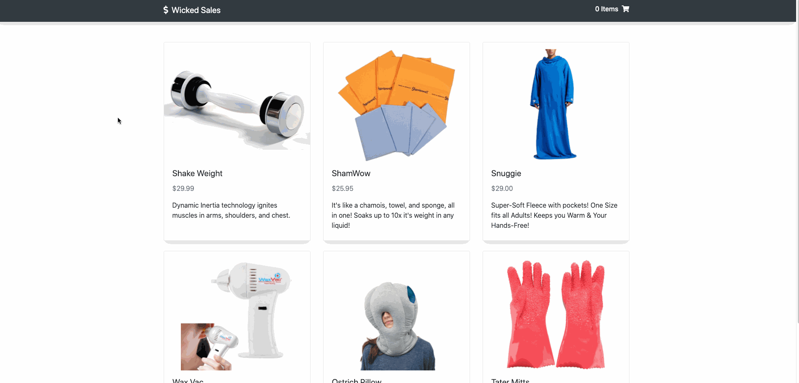

# CMRA
CMRA is a full stack E-commerce web application built using React.js and Node.js/Express.

## Live Demo
Try the application live at https://cmra.johnnyungcodes.com/

## Technologies Used
- React.js
- Node.js
- Express
- PostgreSQL
- Webpack 4
- HTML5
- CSS3
- Bootstrap 4
- AWS EC2

## Features
- User can view a list of products
- User can view a product's details
- User can add products to their shopping cart
- User can view shopping cart
- User can checkout and place an order
- Mobile Responsive: compatible in portrait and landscape mode for iPhone 6/7/8 and iPad

## Preview


## Development

### System Requirements
- Node.js 10 or higher
- NPM 6 or higher
- PostgreSQL

### Getting Started

1. Clone the repository and change directory to cloned folder.

    ```shell
    git clone https://github.com/johnnyung91/cmra-js.git

    cd cmra-js
    ```

2. Install all dependencies with NPM.

    ```shell
    npm install
    ```

3. Initialize PostgreSQL server

    ```shell
    sudo service postgresql start
    ```

4. Import the example database to the PostgreSQL database.

    ```shell
    npm run db:import
    ```

5. Start the project. Once started you can view the application by opening http://localhost:3000 in your browser.

    ```shell
    npm run dev
    ```
